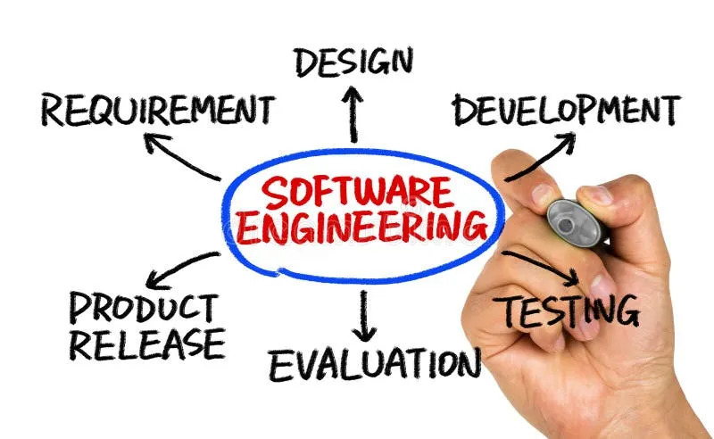

## What is Software Engineering
Software Engineering includes a multitude of various tools, methodologies, and ideas meshed together coherently such that it culminates into a project designed and intended for some practical use. Some particular tools and methodologies are used so often that many software engineers make it synonymous to the process of software engineering. 

## Open Source Software Development
Among the many tools at a software engineer's disposal are open source software. Open source software refers to software that has been developed by many people far and wide. It is the opposite of proprietary software in which that is developed by a dedicated team. One such notable software is GitHub, a place where projects are stored in "repositories" and are often actively being developed on by various people. GitHub is well-known, and thus often used, for how well it maintains such projects. It is what is referred to as "Version Control System," or VCS. Of course there are other VCS similar to GitHub, but GitHub happens to be the most used, especially in the world of open source software development.

Compared to the development of open source software, there is also proprietary software that is maintained by a dedicated team. From this difference, it is often found that open source software tends to be much more effective in performing tasks in comparison to proprietary software. For one example, Adobe software such as Photoshop have open-source equivalents such as Gimp. Both pieces of software are designed with a similar purpose. However, the difference is that because Photoshop is developed and maintained exclusively by Adobe, the way in which a user may acquire and use the program can only be done under the set guidelines and rules, and even licenses that can only be obtained from Adobe themselves. Comparatively, because Gimp is open-source software, it is free to use by anyone with no further restrictions and charges. Sometimes, the developers who maintain the repository of such open-source software may ask for a donation. In contrast to the required paywall to use any Adobe software, this is a difference that many users and creators love open-source software.

## Coding Standards
In the process of developing software, a project could easily go awry when developers make various changes and additions to it. As such, coding standards are applied such that the project does not result in a coding mess that other developers would not understand at a glance and have to waste time to do as such. Coding standards are what allows for developers, especially a team of software engineers, to be able to code efficiently and effectively. It allows for the code to be read and understood quickly, and by following these standards, it also allows for the project development process to run much more smoothly than it otherwise would have. One example of such coding standards is something called ESLint. ESLint, much to the definition of coding standards, is a guildeline designed for code to be written in the same fashion. By doing this, it allows for code to be read much more easily, and thus, be maintained more simply.

## Conclusion
Software Engineering has generated many projects, some of which have become a staple piece of software that various people continue to use to this very day. Other times, it has also produced questionable, or even mildly frustrating, pieces of software - some of which many people continue to use despite the downsides. But despite the production of many different kinds of projects, it is generally understood that the process of software engineering is what makes or breaks a project. Version Control Systems such as GitHub are used as part of standard practice when developing any project, and applying coding standards such as ESLint help reduce any small inconsistencies in the software's code so that it is more easily maintained.
