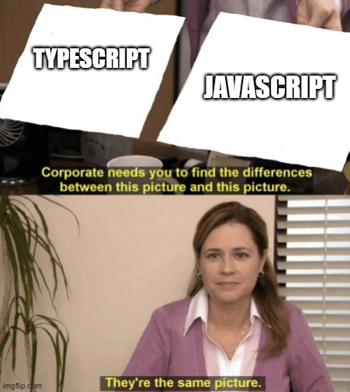

*"Corporate needs you to find the difference between this picture and this picture."*
*Me: "They're the same picture."*

## Isn't This the Same Thing?

From all the programming languages that I have learned over the years, there is incredible similarity of the structure of Typescript and other languages. Of course, being that it is its own programming language, there are some fundamental differences that make it unique in its own right. Typescript, after learning Javascript, isn't so bad to learn through - at least the basics of it - mainly because both are quite literally the same thing. There really isn't THAT big of a learning curve in learning Typescript's intricacies - at least for the most part - but as with any other skill or field, it takes a significant amount of time and commitment in truly learning and incorporating the benefits of Typescript.

Other than Javascript, the other programming languages are fairly similar as well. Albeit with their own intricacies, languages such as C, Java, and Python syntax-wise are pretty much the same. Statements, such as the "if-statement," and loops all seem to be portable across these widely-used tools in the computer science world. Frankly, if programming languages were somehow notorious for being the most difficult in its learnability, absolutely no one would ever use such a difficult thing - especially in this day and age where convenience is rampant. Thankfully, they are not, providing more ease in learning other programming languages.

## Say WOD?

I'll say that I love doing WODs. They give a fun challenge to do in keeping my skills in shape. It really makes me think of quick solutions in solving the problem. If somehow it takes longer for me to complete a WOD, taking a look at the provided solution helps immensely in providing insight in what I am missing in my skillset. All in all, WODs are a very fun activity that I love to partake in my free time. 
