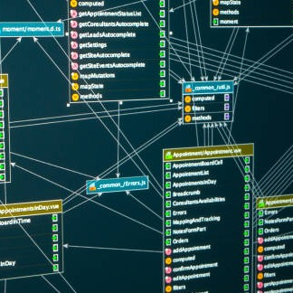

This is a small project created for my ICS 212 class. It is a database designed to store records of personal information. Such information includes the name of a person and the address of that person. The database is capable of adding, searching, deleting, displaying and saving all records. It was developed in both C and ported over to C++ as well.

The database utilizes Object-Oriented Programming in storing the records of personal information. When the database is launched, the user is greeted with a user-friendly interface with a multitude of different options in using the database. When exiting the database program, any and all records that exist in that instance of the database is saved onto a save.txt file. When the database is launched once more, the database searches for any saved records from save.txt and loads all such records back onto it. Any subsequent launches and exits of the database loads and saves all existing records with ease. In case that there may be any issues or bugs, there is a debug mode coded into the database for debugging issues.

Source: <a href="https://github.com/longa2/database"><i class="large github icon "></i>longa2/database</a>
