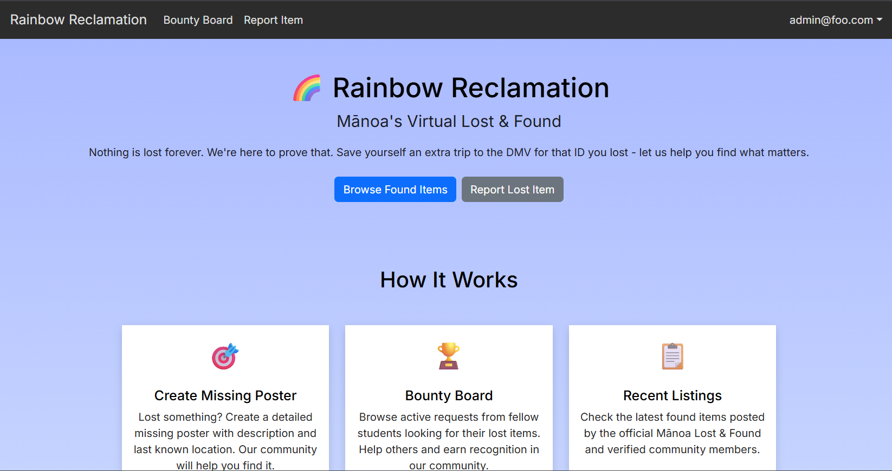

This is a software project created for my ICS 314 class. It is a website designed specifically to  help those who have lost any of their items. 

Source: <a href="https://github.com/longa2/database"><i class="large github icon "></i>longa2/database</a>
